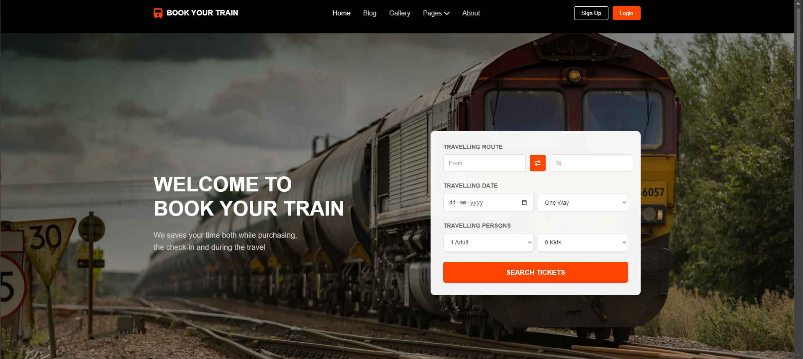
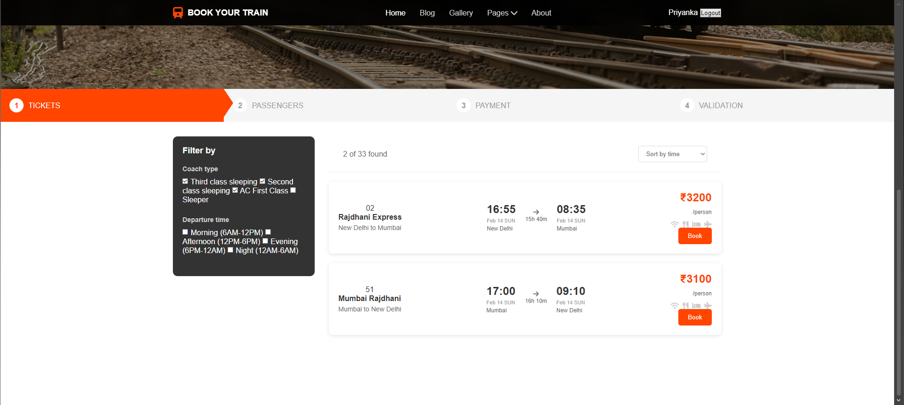
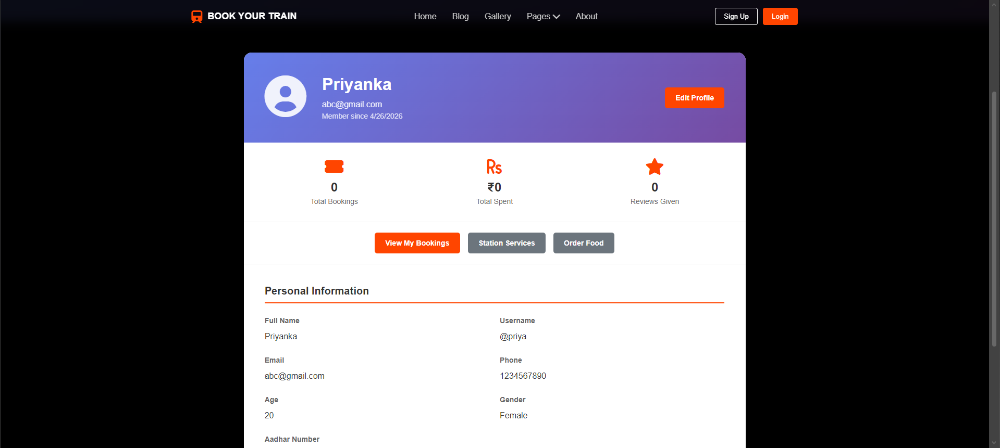
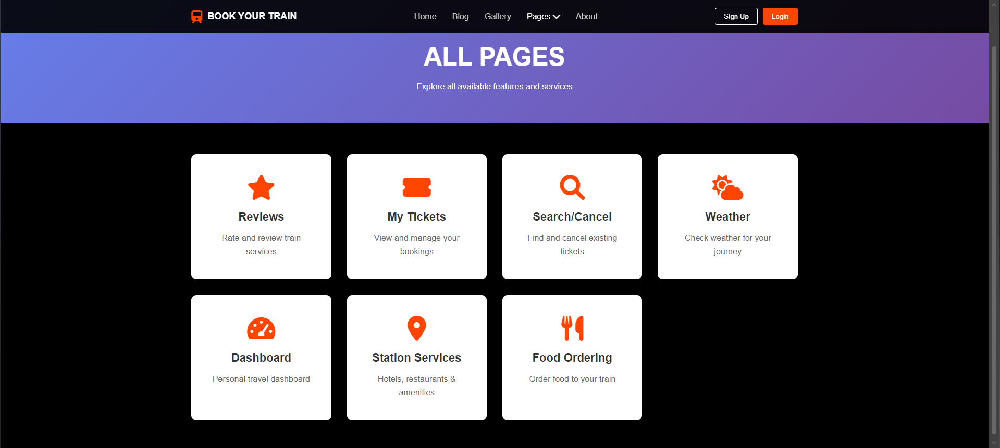

# 🚆 TrainGO — Online Train Reservation System

TrainGO is a web-based train reservation system prototype developed using HTML, CSS, JavaScript, Java, JDBC, and MySQL concepts. The project simulates the workflow of an online railway booking platform with features like train search, ticket booking, seat availability checking, user authentication, booking management, and interactive UI components.

> Note: This project is developed for learning and demonstration purposes using sample railway and booking data.

---

# 📌 Features

## 👤 User Features

* User Registration & Login
* Session-based Authentication
* Train Search by Source & Destination
* Seat Availability Checking
* Ticket Booking Workflow
* Ticket Cancellation & Search
* Profile Management
* Reviews & Ratings System

## 🚉 Booking Features

* Multi-step Booking Process
* Passenger Information Handling
* Booking Confirmation
* Simulated PNR Generation
* Seat-locking Logic Simulation
* Booking Validation

## 🎨 UI & Additional Features

* Responsive User Interface
* Live Weather Widget
* Simulated Live Train Status
* Loyalty Points System
* Dashboard Pages
* Food Ordering & Station Services Sections

---

# 🛠️ Tech Stack

## Frontend

* HTML5
* CSS3
* JavaScript

## Backend Concepts

* Java
* JDBC
* MySQL

## Tools & Platform

* VS Code
* Apache Tomcat(Conceptual Usage)
* Git & GitHub

---

# 🗄️ Database Design

The project uses sample relational database structures for learning purposes.

## Main Tables

* users
* trains
* tickets
* passengers
* reviews

The database design includes:

* Foreign key relationships
* Normalized table structure
* Booking and passenger mapping
* User authentication data

---

# 📂 Project Structure

```bash
Online-Train-Reservation-System/
│
├── Screenshots/
├── index.html
├── script.js
├── styles.css
├── modern-features.js
├── reference-design.css
├── weather-styles.css
├── database.sql
└── README.md
```

---

# ⚙️ How to Run the Project

## Prerequisites

* VS Code
* Live Server Extension

---

## Steps to Run

1. Clone the repository

```bash
git clone https://github.com/your-username/Online-Train-Reservation-System.git
```

2. Open the project folder in VS Code

3. Install the **Live Server** extension

4. Right-click on `index.html`

5. Select:

```text
Open with Live Server
```

6. The project will run locally at:

```text
http://127.0.0.1:5500/index.html
```

---

# 🧠 Concepts Used

* Object-Oriented Programming (OOP)
* JDBC Connectivity Concepts
* CRUD Operations
* Session Management
* Database Normalization
* Responsive Web Design
* Multi-page Booking Workflow
* Frontend State Handling
* Local Storage Usage

---

# 🚀 Future Improvements

* Real-time database integration
* Payment gateway support
* JWT authentication
* Email/SMS notifications
* Live train API integration
* Admin analytics dashboard
* Cloud deployment

---

# 👥 Team Project

This project was developed as a collaborative academic project by a team of 4 members.

## My Contributions

* Contributed to frontend UI development and booking workflow implementation
* Assisted in database schema design and booking data handling
* Worked on authentication and train search functionalities
* Participated in integrating frontend pages with booking logic
* Collaborated on testing, debugging, and overall feature development

---

# 📸 Screenshots

## Home Page



## Ticket Booking



## Profile Page



## All Features Page



---

# 📜 License

This project is developed for educational and learning purposes only.

---

# 📬 Contact

### Priyanka

* GitHub: https://github.com/Priyanka26102005
* LinkedIn: https://linkedin.com/in/priyanka-536247291

If you found this project useful, consider giving it a ⭐ on GitHub.
